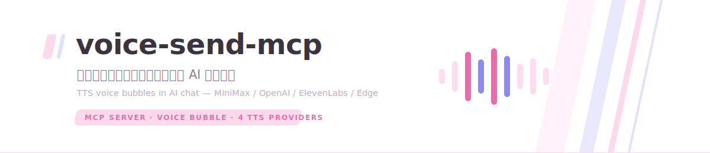

<div align="center">

<picture>
  <source media="(prefers-color-scheme: dark)" srcset=".github/assets/banner-dark.svg">
  
</picture>

[](https://github.com/asashiki/voice-send-mcp/actions/workflows/ci.yml)
[](LICENSE)


**English** · [简体中文](README.zh-CN.md)

</div>

# voice-send

Standalone MCP server for sending short playable voice messages in AI chat clients. It exposes a `voice_send` tool, synthesizes speech through one of four TTS providers, stores the mp3, and returns a `ui://` widget so MCP Apps capable clients can render an in-chat audio bubble.

Example deployed endpoint (yours will differ):

```text
https://voice.example.com/mcp/voice
```

This repository is designed as a complete GitHub-ready MCP tool project: local stdio MCP, remote Streamable HTTP MCP, Docker deployment, typed configuration, CI, and public-safe docs.

## References

Primary MCP references:

- MCP: `https://modelcontextprotocol.io/`
- Transports: `https://modelcontextprotocol.io/docs/concepts/transports`
- MCP Apps: `https://modelcontextprotocol.io/docs/extensions/apps`
- MCP Apps API: `https://apps.extensions.modelcontextprotocol.io/`

Client-specific references:

- Claude Connectors: `https://claude.com/docs/connectors/overview`
- OpenAI Apps SDK: `https://developers.openai.com/apps-sdk`

The implementation follows MCP first. Claude and ChatGPT differences are kept to compatibility metadata, CSP aliases, and widget host bridge code.

## Features

- Local MCP: stdio transport via `npm run start:stdio` or the `voice-send-mcp` bin after build.
- Remote MCP: Streamable HTTP endpoint, default path `/mcp/voice`.
- Compatibility endpoint: `/mcp` is also registered for direct local smoke tests.
- Public audio hosting: generated mp3 files served from `GET /voice/<uuid>.mp3`.
- Health check: `GET /healthz`.
- MCP tool: `voice_send`, input `{ text, senderName? }`.
- MCP resource: `ui://widget/voice-bubble-v2.html`, MIME `text/html;profile=mcp-app`.
- MCP Apps UI: one shared visual UI for Claude and ChatGPT.
- Client compatibility: standard `_meta.ui.resourceUri` plus ChatGPT `openai/outputTemplate`.
- Widget CSP: MCP Apps standard CSP plus ChatGPT `openai/widgetCSP`.
- Multi-provider TTS with auto-detection: **Edge TTS (free, keyless) / MiniMax / OpenAI-compatible / ElevenLabs**, with per-provider input caps and automatic truncation.
- Sakura voice-bubble UI (Asashiki design tokens, light/dark aware): waveform progress, click-to-seek, playing animation.

## Quick Start

```bash
npm install
npm run build
```

For local stdio MCP:

```bash
PUBLIC_BASE_URL=https://voice.example.com MINIMAX_API_KEY=... npm run start:stdio
```

For remote HTTP MCP:

```bash
PUBLIC_BASE_URL=https://voice.example.com MCP_HTTP_PATH=/mcp/voice MINIMAX_API_KEY=... npm start
```

Remote clients connect to:

```text
https://voice.example.com/mcp/voice
```

## Local MCP Configuration

Use stdio when the MCP client runs on the same machine as this project.

Example MCP client config:

```json
{
  "mcpServers": {
    "voice-send": {
      "command": "node",
      "args": ["/absolute/path/to/voice-send/dist/stdio.js"],
      "env": {
        "MINIMAX_API_KEY": "...",
        "PUBLIC_BASE_URL": "https://voice.example.com",
        "MCP_HTTP_PATH": "/mcp/voice"
      }
    }
  }
}
```

The widget needs an audio URL that the host sandbox can fetch. For Claude / ChatGPT UI rendering, use a public HTTPS `PUBLIC_BASE_URL` or run the HTTP server behind a tunnel/reverse proxy. Pure CLI clients can call the tool, but in-chat UI rendering depends on MCP Apps support.

## Remote Domain Deployment

Set:

```bash
PUBLIC_BASE_URL=https://voice.example.com
MCP_HTTP_PATH=/mcp/voice
ALLOWED_ORIGINS=https://voice.example.com
```

The MCP endpoint becomes:

```text
${PUBLIC_BASE_URL}${MCP_HTTP_PATH}
```

The audio URL becomes:

```text
${PUBLIC_BASE_URL}/voice/<uuid>.mp3
```

If audio is served from a different origin, set `MCP_VOICE_AUDIO_ORIGIN` so the widget CSP allows it:

```bash
MCP_VOICE_AUDIO_ORIGIN=https://audio.example.com
```

With Docker Compose:

```bash
cp .env.example .env
# edit .env
docker compose up -d --build
```

Example Caddy reverse proxy config is in `deploy/Caddyfile.example`.

## Environment

Core:

```bash
PUBLIC_BASE_URL=https://voice.example.com
PORT=3000
MCP_HTTP_PATH=/mcp/voice
ALLOWED_ORIGINS=https://voice.example.com
VOICE_DIR=/app/data/voice
VOICE_RETENTION_HOURS=24
MCP_VOICE_AUDIO_ORIGIN=
```

TTS — pick a provider (or leave `auto`):

| Provider | Quality | Cost | Key | Text cap |
|---|---|---|---|---|
| `edge` (keyless default) | Good | Free | none | 5000 |
| `minimax` | Excellent (voice clone) | Paid | `MINIMAX_API_KEY` | 10000 |
| `openai` (any compatible endpoint via `OPENAI_TTS_BASE_URL`) | Good | Paid | `OPENAI_API_KEY` | 4096 |
| `elevenlabs` | Excellent | Paid | `ELEVENLABS_API_KEY` | 10000 |

`TTS_PROVIDER=auto` (default) picks the first configured: minimax → elevenlabs → openai → edge. Override any cap with `TTS_MAX_TEXT_LENGTH`.

```bash
TTS_PROVIDER=auto

# Edge TTS (free, no key — note: some datacenter IPs get WebSocket 403)
EDGE_TTS_VOICE=zh-CN-XiaoxiaoNeural
# EDGE_TTS_RATE=+0%  EDGE_TTS_PITCH=+0Hz  EDGE_TTS_VOLUME=+0%

# MiniMax T2A v2 (use api.minimaxi.com with mainland token-plan keys)
MINIMAX_API_KEY=
MINIMAX_API_BASE_URL=https://api.minimaxi.com/v1/t2a_v2
MINIMAX_MODEL=speech-2.8-hd
MINIMAX_VOICE_ID=female-shaonv   # system voice id, or your cloned voice id
# MINIMAX_GROUP_ID=            # set if the API reports group_id required
MINIMAX_VOICE_SPEED=1
MINIMAX_VOICE_VOLUME=1
MINIMAX_VOICE_PITCH=0
MINIMAX_SAMPLE_RATE=32000
MINIMAX_BITRATE=128000
MINIMAX_AUDIO_FORMAT=mp3
MINIMAX_CHANNEL=1

# OpenAI TTS / OpenAI-compatible
OPENAI_API_KEY=
OPENAI_TTS_BASE_URL=https://api.openai.com/v1
OPENAI_TTS_MODEL=gpt-4o-mini-tts
OPENAI_TTS_VOICE=alloy
OPENAI_TTS_SPEED=1

# ElevenLabs
ELEVENLABS_API_KEY=
ELEVENLABS_VOICE_ID=pNInz6obpgDQGcFmaJgB
ELEVENLABS_MODEL_ID=eleven_multilingual_v2
```

Widget UI: styled with the Asashiki sakura design tokens (light/dark via `prefers-color-scheme`); no env styling knobs. After widget changes, bump the version in `src/widget/voice-bubble-html.ts` (`voice-bubble-v2.html` → `v3`...) — hosts cache `ui://` resources by URI.

## Claude And ChatGPT UI

There is one visual UI implementation. The widget still has two host bridge paths because current clients expose tool results differently:

- ChatGPT: `window.openai.toolOutput` and `openai:set_globals`.
- Claude / MCP Apps: `@modelcontextprotocol/ext-apps` `App.connect()` and `ontoolresult`.

The server also emits both metadata forms:

- MCP Apps standard: `_meta.ui.resourceUri`.
- ChatGPT compatibility alias: `_meta["openai/outputTemplate"]`.

The CSS no longer intentionally styles Claude and ChatGPT differently. If client-specific fixes become necessary, keep them as narrow compatibility patches.

## Development

```bash
npm run dev
npm run dev:stdio
npm run typecheck
npm run build
docker build -t voice-send-mcp:local .
```

Generated files:

- `dist/server.js`: remote HTTP server.
- `dist/stdio.js`: local stdio MCP server.
- `dist/widget/voice-bubble-widget.global.js`: browser IIFE inlined into the `ui://` HTML resource.

## Client Notes

- Claude and ChatGPT cache `ui://` resources by URI. Bump `VOICE_BUBBLE_URI` in `src/widget/voice-bubble-html.ts` after widget HTML/JS changes.
- MCP Apps resources use MIME `text/html;profile=mcp-app`.
- Keep both CSP namespaces: `_meta.ui.csp.resourceDomains` and `_meta["openai/widgetCSP"].resource_domains`.
- The widget uses `@modelcontextprotocol/ext-apps` with `app.connect()` default transport. Do not manually construct `PostMessageTransport(window.parent, window)`.
- Streamable HTTP deployments should validate `Origin`; this project uses `ALLOWED_ORIGINS`.

## Repository Layout

```text
src/
  backend/                    TTS providers (minimax / openai / elevenlabs / edge) + registry
  config.ts                   environment parsing
  mcp.ts                      tools/resources registration
  schemas.ts                  zod input/output schemas
  server.ts                   Streamable HTTP server
  stdio.ts                    local stdio MCP entry
  widget/                     MCP Apps widget HTML and browser runtime
scripts/build-widget.mjs      bundles widget runtime as browser IIFE
deploy/Caddyfile.example      domain reverse proxy example
Dockerfile                    production image
docker-compose.yml            single-service deployment
```

## License

MIT
